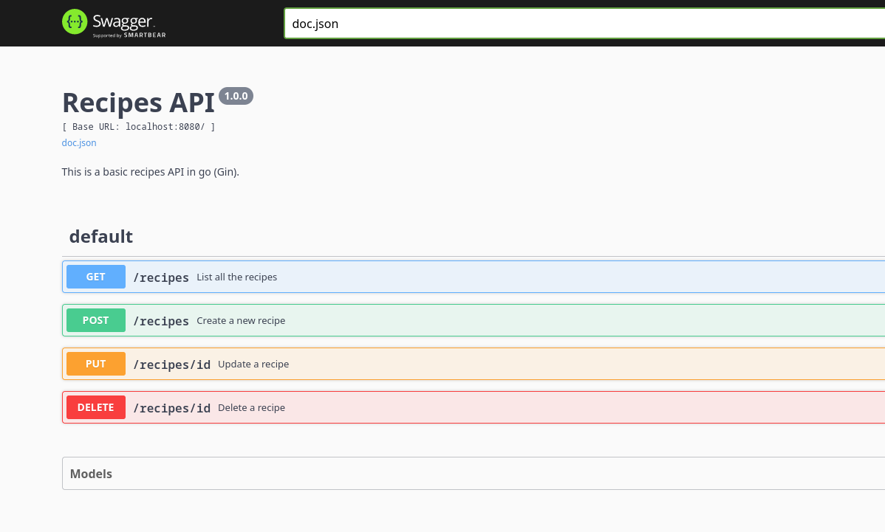

## 02-basic-rest-api

A basic rest api with gin that accepts mutiple methods (GET, POST, PUT, DELETE) and endpoints

- Uses in-memory storage, i.e no data persistance
- API documentatio nwith swagger

## Steps to run

```bash
> go mod download
> go run ./
```

## Swagger Documentation

The swagger documentation for the apis is available at [localhost:9000/swagger/index.html](localhost:9000/swagger/index.html)
<br/>

